<!-- ========================================================================= -->
<!--                           SANJAY G P - GITHUB PROFILE                      -->
<!--                       THEME: AI TERMINAL / CYBERPUNK / ANIME               -->
<!-- ========================================================================= -->

<div align="center">

  <!-- HERO BANNER -->
  <a href="https://github.com/sanjaygp-22">
    
  </a>

  <br/><br/>

  <!-- BADGES BAR -->
  <p align="center">
    <a href="https://github.com/sanjaygp-22">
      
    </a>
    <a href="https://github.com/sanjaygp-22">
      
    </a>
    <a href="https://komarev.com/ghpvc/?username=sanjaygp-22&label=PROFILE+VIEWS&color=00F0FF&style=for-the-badge">
      
    </a>
    <a href="https://github.com/sanjaygp-22">
      
    </a>
    <a href="https://github.com/sanjaygp-22">
      
    </a>
  </p>

  <!-- ANIMATED TYPING SUBTITLE -->
  <a href="https://github.com/sanjaygp-22">
    
  </a>

  <br/><br/>

  <!-- CYBER DIVIDER -->
  

</div>

<br/>

<!-- ========================================================================= -->
<!-- BOOT TERMINAL (SANJAY_OS v2.6)                                            -->
<!-- ========================================================================= -->

<div align="center">
  
</div>

<div align="center">

  <p align="center">
    <font color="#00F0FF" size="3"><b>🤖 VISITOR COUNTER</b></font><br/>
    <font color="#8B949E" size="2">Thanks for visiting!</font><br/><br/>
    <a href="https://github.com/sanjaygp-22">
      
    </a><br/><br/>
    <font color="#00F0FF" size="2"><b>Total Visitors</b></font>
  </p>

</div>

<br/>

```bash
user@sanjaygp-22:~$ ./init_system.sh --boot-sequence

[SYSTEM_BOOT] Initializing SANJAY_OS Kernel v2.6.0-release...
[SYSTEM_BOOT] Allocating 64GB Neural Array Buffer..................... [ OK ]
[SYSTEM_BOOT] Accessing Developer Neural Profile....................... [ ACCESS GRANTED ]
[SYSTEM_BOOT] Authenticating Identity: SANJAY G P...................... [ VERIFIED ]
[SYSTEM_BOOT] Loading Core Modules: AI | ML | DL | CV | Java | Python.. [ LOADED ]
[SYSTEM_BOOT] Establishing Secure Link to Satellite Server India........ [ CONNECTED ]

=================================================================================
 Identity       : SANJAY G P
 Primary Role   : Artificial Intelligence & Data Science Student
 Current Status : ONLINE & ACTIVELY BUILDING
 Core Focus     : AI, Machine Learning, Deep Learning, Computer Vision
 Mission Goal   : Build intelligent software that solves real-world problems.
=================================================================================

user@sanjaygp-22:~$ cat mission_statement.txt
> "Consistency creates mastery. Turning complex data into actionable intelligence."

user@sanjaygp-22:~$ _
```

<br/>

<div align="center">
  
</div>

<br/>

<!-- ========================================================================= -->
<!-- ABOUT ME SECTION                                                          -->
<!-- ========================================================================= -->

## ⚡ 01. SYSTEM ARCHITECTURE // ABOUT ME

Welcome to my digital neural network. I am an **Artificial Intelligence & Data Science Student** based in **India**. My passion lies in crafting high-performance machine learning models, computer vision systems, and backend software architectures that address tangible challenges.

<br/>

<table width="100%">
  <tr>
    <td width="50%" valign="top">
      <h3>🎓 Education & Background</h3>
      <ul>
        <li><b>Degree:</b> B.Tech in Artificial Intelligence & Data Science</li>
        <li><b>Location:</b> India 🇮🇳</li>
        <li><b>Domain:</b> AI Engineering & Applied Data Science</li>
        <li><b>Mindset:</b> Continuous learner, obsessed with optimization & performance.</li>
      </ul>
      <br/>
      <h3>⚡ Current Focus & Explorations</h3>
      <ul>
        <li>🧠 <b>Deep Learning:</b> Neural network architectures & Transformers</li>
        <li>👁️ <b>Computer Vision:</b> Real-time object detection & facial recognition</li>
        <li>⚙️ <b>Backend Engineering:</b> Scalable APIs & Java architecture</li>
        <li>📱 <b>Cross-Platform:</b> Flutter mobile AI integration</li>
      </ul>
    </td>
    <td width="50%" valign="top">
      <h3>💻 संजय_OS // SanjayGP.java</h3>
      <pre><code>public class SanjayGP extends Developer implements AIStudent {
    
    private final String name = "Sanjay G P";
    private final String location = "India";
    private String status = "ONLINE_BUILDING";
    
    private String[] languages = {"Java", "Python", "C"};
    private String[] coreFocus = {
        "Artificial Intelligence",
        "Machine Learning",
        "Deep Learning",
        "Computer Vision",
        "Backend Architecture"
    };

    public SanjayGP() {
        super.setMission("Build intelligent software for real-world impact.");
        super.setPassion("Continuous Learning & Innovation");
    }

    public void executeDailyRoutine() {
        while (alive) {
            code();
            trainNeuralModels();
            solveProblems();
            repeat();
        }
    }
}</code></pre>
    </td>
  </tr>
</table>

<br/>

<div align="center">
  
</div>

<br/>

<!-- ========================================================================= -->
<!-- TECH STACK MATRIX                                                         -->
<!-- ========================================================================= -->

## 🛠️ 02. NEURAL HARDWARE // TECH STACK MATRIX

Technologies and tools integrated into my daily development workflow:

<br/>

<div align="center">

  <!-- Core Languages -->
  <p align="center">
    <b>LANGUAGES</b><br/>
    <a href="https://skillicons.dev">
      
    </a>
  </p>

  <br/>

  <!-- AI & Machine Learning -->
  <p align="center">
    <b>AI / ML / COMPUTER VISION</b><br/>
    <a href="https://skillicons.dev">
      
    </a>
    <br/><br/>
    
    
  </p>

  <br/>

  <!-- Frameworks & Mobile -->
  <p align="center">
    <b>FRAMEWORKS & MOBILE</b><br/>
    <a href="https://skillicons.dev">
      
    </a>
  </p>

  <br/>

  <!-- Databases & Operating Systems -->
  <p align="center">
    <b>DATABASE & OPERATING SYSTEM</b><br/>
    <a href="https://skillicons.dev">
      
    </a>
  </p>

  <br/>

  <!-- Developer Tools -->
  <p align="center">
    <b>TOOLS & IDE</b><br/>
    <a href="https://skillicons.dev">
      
    </a>
  </p>

</div>

<br/>

### 📊 Proficiency Matrix

| Domain / Skill | Level | Primary Tech |
| :--- | :--- | :--- |
| **Machine Learning & Data Science** |  | Python, Scikit-Learn, Pandas |
| **Deep Learning & Neural Networks** |  | TensorFlow, Keras |
| **Computer Vision** |  | OpenCV, Python |
| **Software Engineering & Java Architecture** |  | Java, OOP, Data Structures |
| **Cross-Platform Mobile Dev** |  | Flutter, Dart |

<br/>

<div align="center">
  
</div>

<br/>

<!-- ========================================================================= -->
<!-- GITHUB DASHBOARD & ANALYTICS                                              -->
<!-- ========================================================================= -->

## 📈 03. TELEMETRY & ANALYTICS // GITHUB DASHBOARD

<br/>

<div align="center">

  <!-- GitHub Stats & Streak -->
  <p align="center">
    <a href="https://github.com/sanjaygp-22">
      
    </a>
    <a href="https://github.com/sanjaygp-22">
      
    </a>
  </p>

  <br/>

  <!-- Top Languages & Activity Graph -->
  <p align="center">
    <a href="https://github.com/sanjaygp-22">
      
    </a>
    <a href="https://github.com/sanjaygp-22">
      
    </a>
  </p>

  <br/>

  <!-- GitHub Trophies -->
  <p align="center">
    <a href="https://github.com/sanjaygp-22">
      
    </a>
  </p>

</div>

<br/>

<!-- ========================================================================= -->
<!-- PAC-MAN CONTRIBUTION GRAPH                                                -->
<!-- ========================================================================= -->

### 👾 PAC-MAN CONTRIBUTION GRAPH

Automated daily contribution graph powered by GitHub Actions:

<div align="center">
  
</div>

<br/>

<div align="center">
  
</div>

<br/>

<!-- ========================================================================= -->
<!-- FEATURED PROJECTS CARDS                                                   -->
<!-- ========================================================================= -->

## 🚀 04. DEPLOYED ARTIFACTS // FEATURED PROJECTS

Highlight of core projects engineered for impact and practical problem-solving:

<br/>

<table width="100%">
  <tr>
    <td width="50%" valign="top">
      <h3>🛡️ AI Crack Detection</h3>
      <p>Computer Vision powered system designed to identify, localize, and assess structural cracks in concrete infrastructures using convolutional neural networks (CNNs).</p>
      <p>
        
        
        
      </p>
      <p><a href="https://github.com/sanjaygp-22"><b>View Repository ➔</b></a></p>
    </td>
    <td width="50%" valign="top">
      <h3>🪨 Rockfall Risk Prediction</h3>
      <p>Predictive geological machine learning framework calculating rockfall probability based on slope dynamics, weather data, and spatial sensor features.</p>
      <p>
        
        
        
      </p>
      <p><a href="https://github.com/sanjaygp-22"><b>View Repository ➔</b></a></p>
    </td>
  </tr>
  <tr>
    <td width="50%" valign="top">
      <h3>👤 Attendance Face Recognition</h3>
      <p>Automated biometric attendance management software powered by OpenCV facial recognition and MySQL database synchronization for educational institutions.</p>
      <p>
        
        
        
      </p>
      <p><a href="https://github.com/sanjaygp-22"><b>View Repository ➔</b></a></p>
    </td>
    <td width="50%" valign="top">
      <h3>🥗 Ingredient Safety Scanner</h3>
      <p>Smart OCR and AI scanner evaluating packaged food product labels for harmful additives, allergens, and safety scores in real time.</p>
      <p>
        
        
        
      </p>
      <p><a href="https://github.com/sanjaygp-22"><b>View Repository ➔</b></a></p>
    </td>
  </tr>
</table>

<br/>

<div align="center">
  
</div>

<br/>

<!-- ========================================================================= -->
<!-- TIMELINE & LEARNING ROADMAP                                               -->
<!-- ========================================================================= -->

## 🌌 05. EVOLUTION LOG // TIMELINE & ROADMAP

- 🔵 **PHASE 01 // FOUNDATIONS**: Mastered Java, C, and Python syntax. Deep dive into Data Structures, Object-Oriented Programming, and Algorithm optimization.
- 🟣 **PHASE 02 // DATA SCIENCE & CV**: Explored NumPy, Pandas, Scikit-Learn, and OpenCV. Engineered image processing pipelines and predictive models.
- 🔷 **PHASE 03 // DEEP LEARNING ARCHITECTURES**: Built CNNs for defect detection and facial recognition using TensorFlow. Integrated mobile frontends using Flutter and SQL backends.
- 🟢 **PHASE 04 // 2026 GOALS & BEYOND**: Contributing to major open-source AI frameworks, building end-to-end AI products, achieving 1000+ GitHub contributions.

<br/>

<div align="center">
  
</div>

<br/>

<!-- ========================================================================= -->
<!-- CERTIFICATIONS & ACHIEVEMENTS                                             -->
<!-- ========================================================================= -->

## 🏆 06. VERIFIED CREDENTIALS // CERTIFICATIONS

| Icon | Certification Title | Specialization / Focus |
| :---: | :--- | :--- |
| 🏅 | **Deep Learning Specialization** | Neural Networks, CNNs, Sequence Models |
| 📜 | **TensorFlow Developer Certificate** | Computer Vision & Model Deployment |
| ⭐️ | **Problem Solving (Java / Algorithms)** | Data Structures & Algorithmic Efficiency |
| 🌐 | **Applied Data Science & OpenCV** | Computer Vision & Real-time Analytics |

<br/>

<div align="center">
  
</div>

<br/>

<!-- ========================================================================= -->
<!-- 2026 OBJECTIVES & CHECKLIST                                               -->
<!-- ========================================================================= -->

## 🎯 07. MISSION OBJECTIVES // 2026 ROADMAP

- [x] **[COMPLETED]** Master Core Java & Data Structures
- [x] **[COMPLETED]** Build AI Crack Detection & Computer Vision Projects
- [/] **[IN PROGRESS]** Master Machine Learning & Advanced Deep Learning Architectures
- [ ] **[PLANNED]** Reach 1,000+ Contributions on GitHub in 2026
- [ ] **[PLANNED]** Contribute to Top Open-Source Artificial Intelligence Repositories
- [ ] **[PLANNED]** Deploy Production-Ready AI SaaS Applications

<br/>

<div align="center">
  
</div>

<br/>

<!-- ========================================================================= -->
<!-- CONNECT & SOCIAL HUD                                                     -->
<!-- ========================================================================= -->

## 📞 08. NEURAL LINK // CONNECT WITH ME

Feel free to reach out for collaborations, project discussions, or tech conversations:

<br/>

<div align="center">

  <a href="https://github.com/sanjaygp-22">
    
  </a>
  <a href="https://linkedin.com/in/sanjaygp">
    
  </a>
  <a href="https://leetcode.com/u/sanjaygp">
    
  </a>
  <a href="https://codechef.com/users/sanjaygp">
    
  </a>
  <a href="mailto:sanjaygp2004@gmail.com">
    
  </a>

</div>

<br/><br/>

<!-- ========================================================================= -->
<!-- FOOTER & BACK TO TOP                                                      -->
<!-- ========================================================================= -->

<div align="center">

  <p align="center">
    <b>"Consistency creates mastery."</b><br/>
    <font color="#8B949E">Thank you for visiting my GitHub Profile!</font>
  </p>

  <br/>

  <a href="#-sanjay-g-p---github-profile">
    
  </a>

  <br/><br/>

  <p align="center">
    <font color="#8B949E" size="2">
      Designed with 💙 &amp; Cyberpunk Energy for <b>Sanjay G P</b> • © 2026 All Rights Reserved
    </font>
  </p>

</div>
